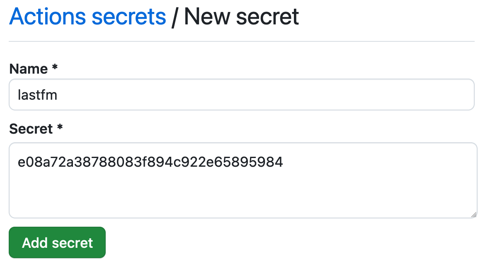
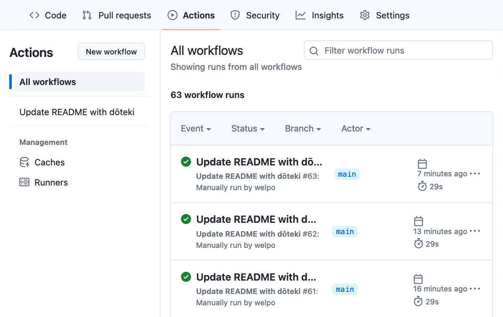
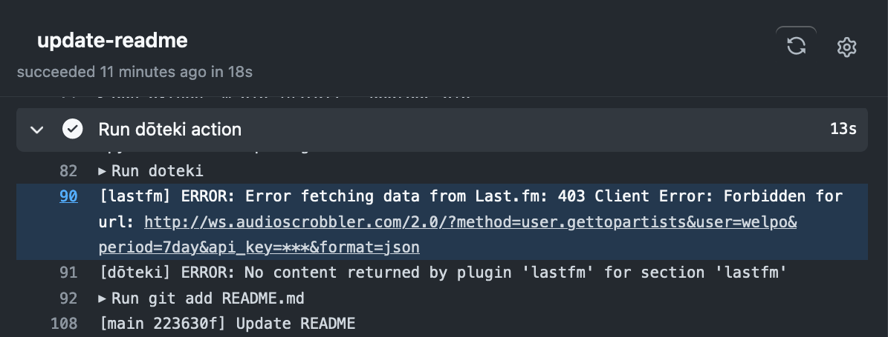

<p align="center">
    <a href="https://doteki.org/">
        
    </a>
    <br>
    <a href="https://github.com/welpo/doteki-action/releases"></a>
    <a href="https://doteki.org/docs">
        </a>
    <a href="https://github.com/welpo/doteki/blob/main/COPYING">
        </a>
    <a href="https://doteki.org">
        </a>
</p>

# 🎋 Run dōteki Action

This GitHub action runs [dōteki](https://doteki.org) to update your GitHub profile README with dynamic content.

## Usage

1. Follow the [Initial Setup instructions from dōteki](https://doteki.org/docs) to set up `doteki.toml` and the matching markers in `README.md`.

2. In your profile repository, create the workflow file `.github/workflows/doteki.yaml` with the following content:

```yaml
name: Update README with dōteki

on:
  push:
  workflow_dispatch:
  schedule:
    - cron: '51 * * * *'  # Every hour at XX:51.

jobs:
  update-readme:
    runs-on: ubuntu-latest
    permissions:
      contents: write  # Necessary to push changes.
    steps:
      - name: Run dōteki action
        uses: welpo/doteki-action@main
        env:
          GITHUB_TOKEN: ${{ secrets.GITHUB_TOKEN }}
```

This workflow will run every time you push to your repository, every hour at XX:51, and when you manually trigger it from the Actions tab.

<details>
<summary>What's inside the workflow file?</summary>
<ul>
    <li><b><code>name</code>:</b> 'Update README with dōteki' labels the action. You'll see this name in the Actions tab.</li>
    <li><b><code>on</code>:</b> Indicates when the action should run. In this case, it runs on push, when manually triggered, and every hour at XX:51.</li>
    <li><b><code>jobs</code>:</b> The 'update-readme' job defines the action's tasks.</li>
    <li><b><code>runs-on</code>:</b> The job runs on the latest Ubuntu version ('ubuntu-latest').</li>
    <li><b><code>permissions</code>:</b> 'contents: write' allows changes to the repository. Otherwise the README couldn't be updated.</li>
    <li><b><code>steps</code>:</b>
        <ul>
            <li>Runs the latest version of the dōteki action ('welpo/doteki-action@main').</li>
        </ul>
    </li>
    <li><b><code>env</code>:</b> Uses 'GITHUB_TOKEN' to authenticate with GitHub. This is necessary to push changes to the repository.</li>
</ul>
</details>

3. Commit and push the workflow file to your repository.

4. That's it! The action will run automatically and update your README.

## Frequently Asked Questions

### How do I configure dōteki?

Simply modify `doteki.toml` and the README markers. [See the docs](https://doteki.org/docs/configuration/).

You don't need to modify the workflow file unless you want to change the schedule, the `doteki-action` version, or the environment variables.

### A plugin needs me to set an environment variable. How do I do that?

If a plugin is asking you to set an environment variable, it's because it needs to access sensitive information, such as an API key. If you added this information to `doteki.toml`, it would be visible to anyone who can see your repository.

The solution is to use GitHub's [secrets](https://docs.github.com/en/actions/security-guides/using-secrets-in-github-actions).

On your profile repository, go to the "Settings" tab and click on "Secrets and variables", then "Actions".

There you can create a new repository secret, say, "lastfm", and add the value for the variable there:



Finally, in your workflow file, add a line at the end of the `steps` section, inside `env`:

```yaml
env:
  DOTEKI_LASTFM_API_KEY: ${{ secrets.lastfm }}
```

**Note**: The string on the left side is the name of the environment variable that the plugin expects. `secrets.<name>` must match the name of the secret you created.

### Something didn't go as expected. Where can I find logs?

Open your GitHub profile repository and go to the "Actions" tab. There you will find a list of all the workflows that have been run:



Click on the one you are interested in, and then on the "update-readme" job.

There you can search the logs or open the "Run dōteki action" step to see the full logs. For example, if you used an invalid Last.fm API key, you would see:



### I have a question that is not answered here. What should I do?

Don't hesitate to reach out via the [issue tracker](https://github.com/welpo/doteki-action/issues), [discussions](https://github.com/welpo/doteki-action/discussions), or [email](mailto:osc@osc.garden?subject=[GitHub]%20dōteki-action).
